# Professional Identity 🚀

### Full-Stack Digital Professional Identity & Verified Portfolio Platform

**Professional Identity** is a modern, unified platform designed specifically for developers, engineers, and digital creators to consolidate their entire professional presence into a single, verified, high-converting digital identity.

Instead of circulating fragmented links across LinkedIn, GitHub, static PDF CVs, portfolio sites, and coding platforms, **Professional Identity** provides a single source of truth accessible through a custom handle (`/u/:handle`) or an instant dynamic QR code.

Built entirely on the **Serverpod 4** and **Flutter** ecosystem, it delivers real-time customization, cloud-backed CV hosting, private client inquiry management, and privacy-conscious analytics — seamlessly responsive across Web, Android, and iOS.

---

## 🌟 Live Demo & Downloads

- 🌐 **Web App**: [https://professional-identity.serverpod.space](https://professional-identity.serverpod.space)
- 👤 **Example Profile**: [https://professional-identity.serverpod.space/u/mohamed-ayad](https://professional-identity.serverpod.space/u/mohamed-ayad)
- 📱 **Android App (APK)**: [Download Release APK](https://drive.google.com/file/d/1MqJqqSLiBAwSGYR1TiC_0Ppc8Lwt-ZJX/view?usp=sharing)
- 💻 **GitHub Repository**: [https://github.com/Muhammed-Ayad/professional-identity](https://github.com/Muhammed-Ayad/professional-identity)

---

## 📸 Application Showcase

### 🌐 1. Public Profile & Visitor Experience
Visitors can explore your verified bio, categorized technical stack, work experience timeline, featured projects, and contact channels without creating an account.

| Verified Header & Quick Actions | About & Categorized Tech Stack |
| :---: | :---: |
| 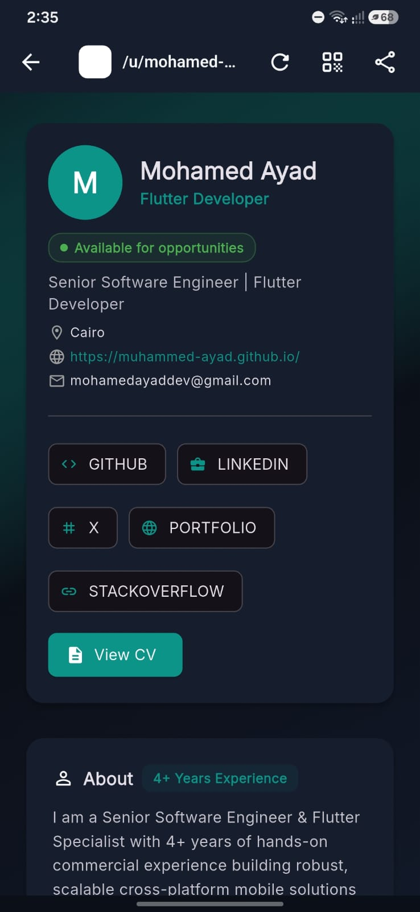 | 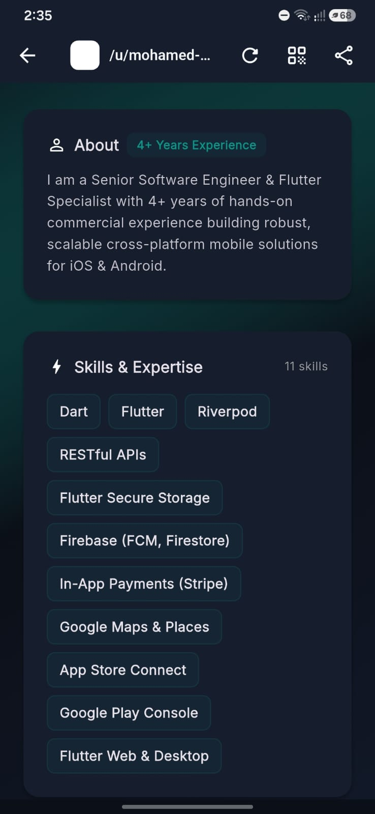 |

---

### 📱 2. Mobile Dashboard & Instant Share
Real-time completion tracking, quick status toggling, and native dynamic QR code generation for conferences, interviews, and networking.

| Dashboard & Completion Tracker | Dynamic QR Code & Instant Share |
| :---: | :---: |
| 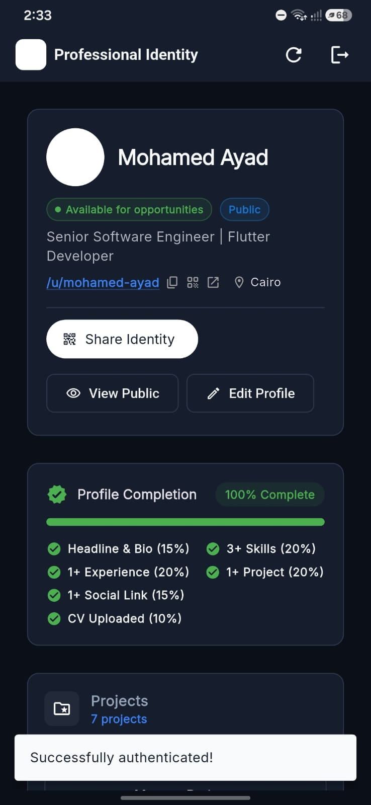 | 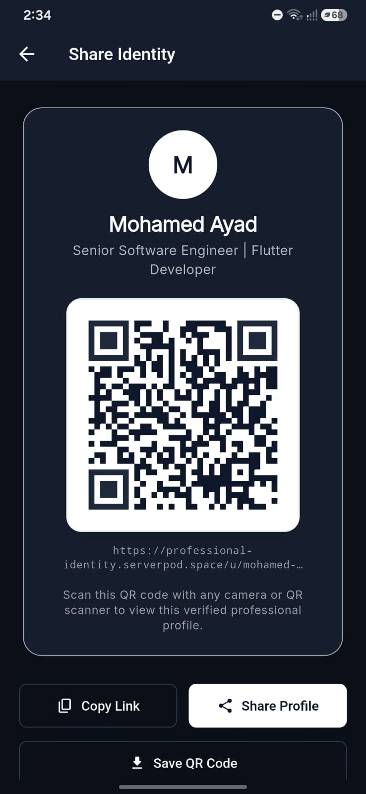 |

---

### 🛠 3. Profile Content & Portfolio Management
Full CRUD management with drag-to-reorder prioritization across all profile sections.

| Skills & Tech Categorization | Featured Projects & Live Demos | Work Experience Timeline |
| :---: | :---: | :---: |
| 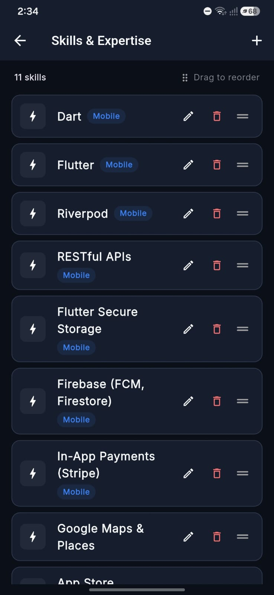 | 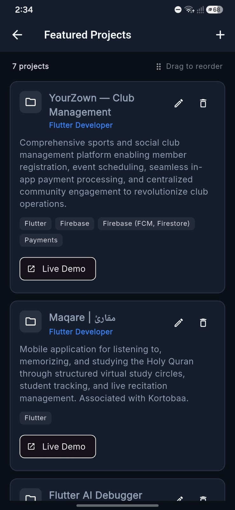 | 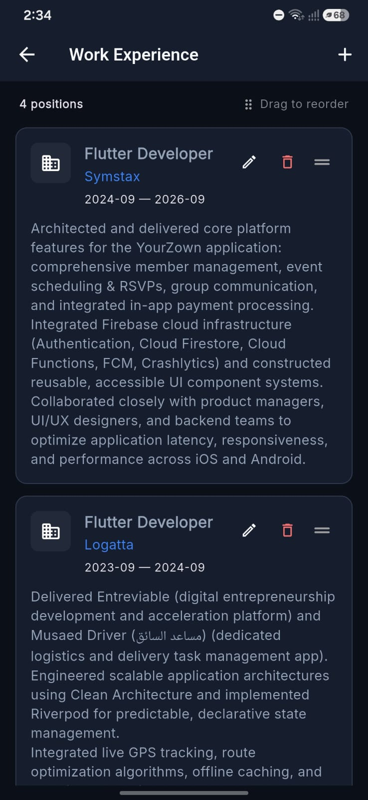 |

| Professional Links & Networks | Cloud CV & Resume Management |
| :---: | :---: |
| 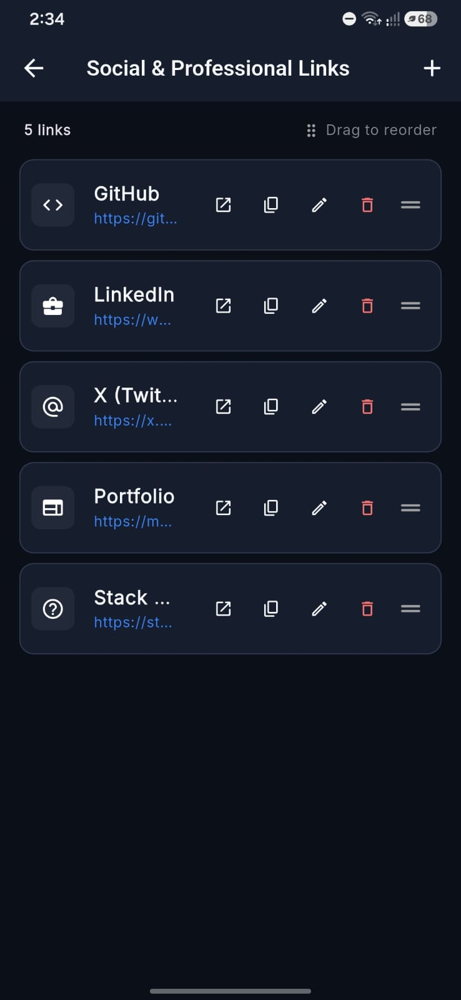 | 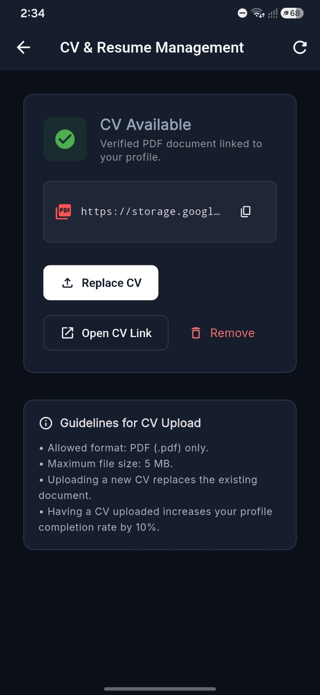 |

---

### 🎨 4. Real-time Appearance & Profile Customizer
Personalize theme presets, accent colors, background styles, card aesthetics, and typography with an interactive live browser preview.

| Theme Presets & Accents | Card Styling & Typography | Live Interactive Preview |
| :---: | :---: | :---: |
| 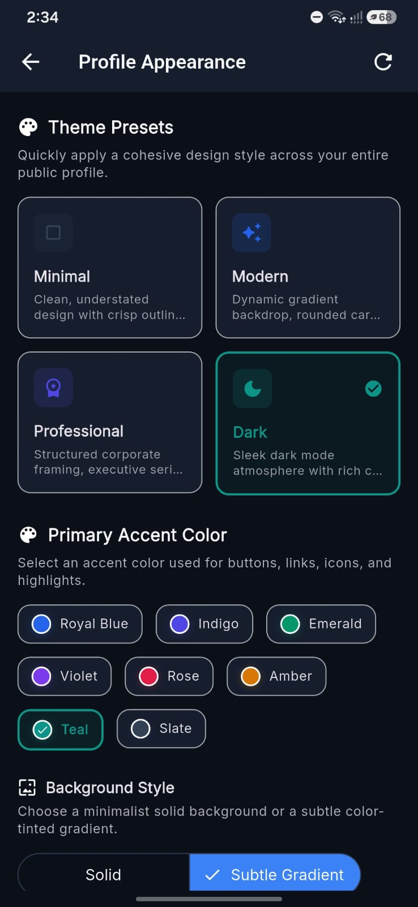 | 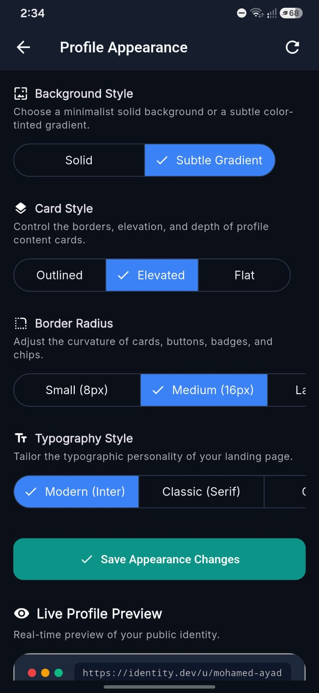 | 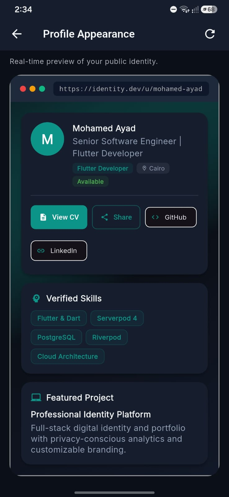 |

---

### 📊 5. Analytics & Recruiter Inquiries
Privacy-first engagement tracking without cookies, coupled with a private inbox for client proposals and recruiter inquiries.

| Engagement & Overview Metrics | Traffic Charts & Top Links | Recruiter Inquiries Inbox |
| :---: | :---: | :---: |
| 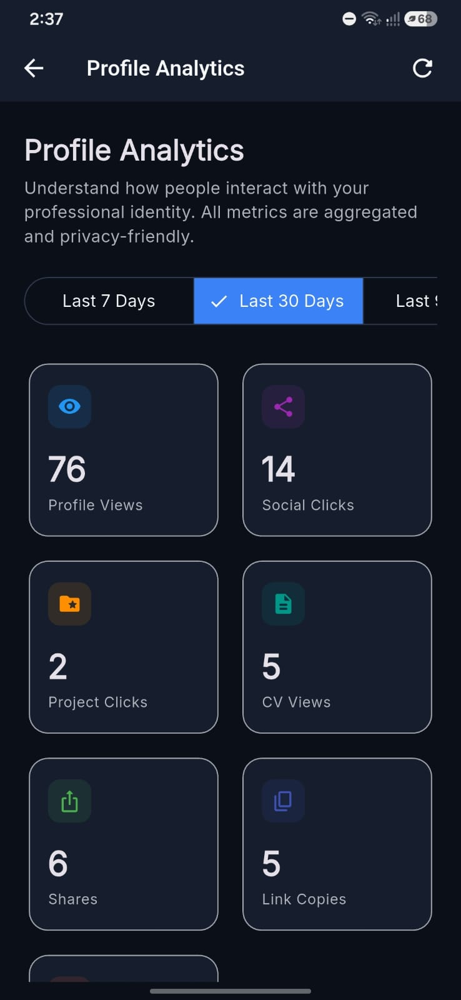 | 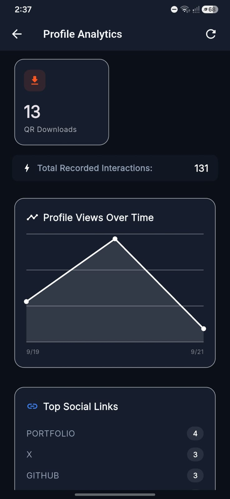 | 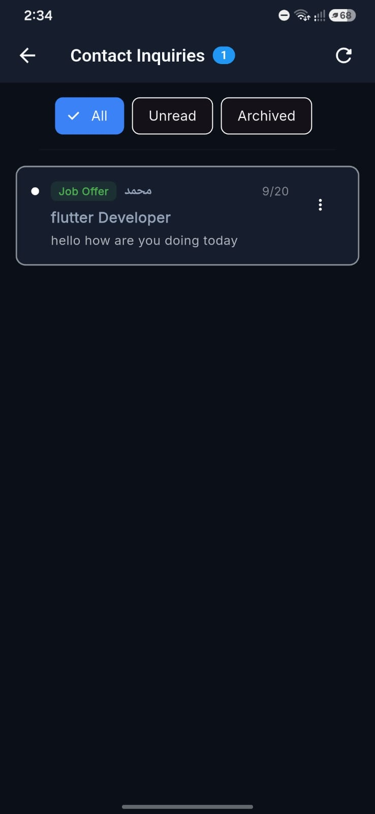 |

---

### 🔐 6. Authentication & Account Recovery
Serverpod-powered email authentication with secure session handling and self-service password recovery.

| Secure Sign In | Easy Registration | Self-Service Password Reset |
| :---: | :---: | :---: |
| 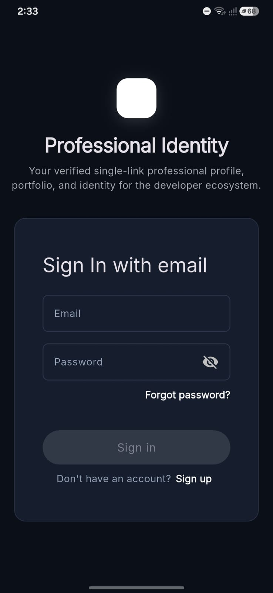 | 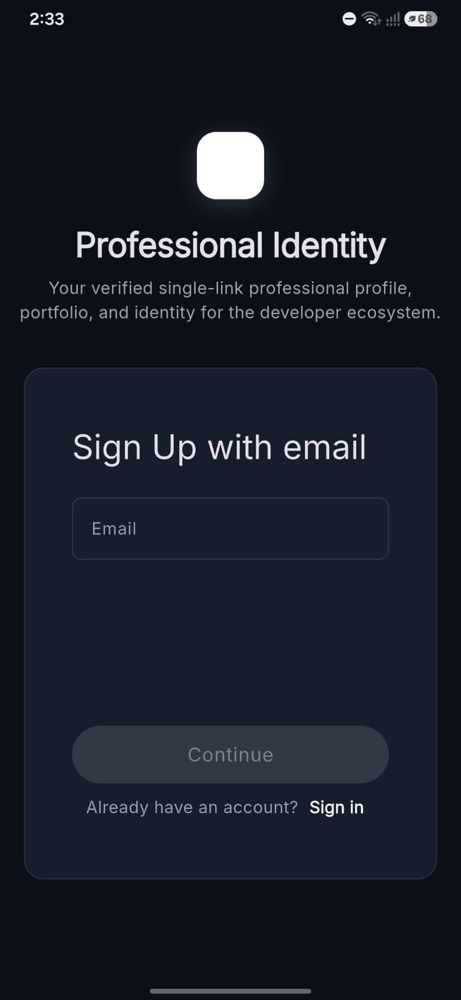 | 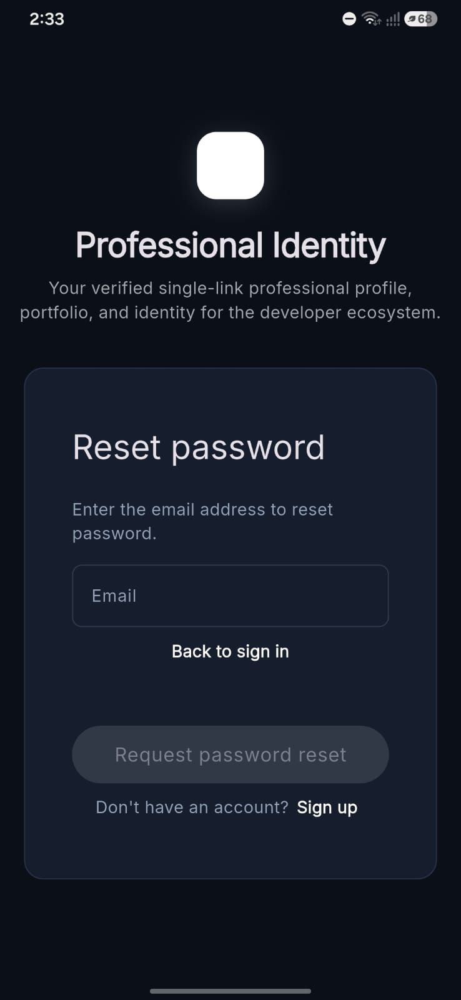 |

---

## ✨ Key Features

### 👤 Professional Profile & Handle
- Verified public profile with customizable handle (`/u/:handle`).
- Rich headline, bio, location, and availability badge (e.g., *Available for opportunities*).
- Instant visibility toggle between public and private.

### 💼 Portfolio & Work Experience
- Showcase featured projects with tech tags, description, GitHub links, and Live Demo buttons.
- Chronological work experience timeline with roles, companies, dates, and achievements.
- Intuitive drag-to-reorder interface to spotlight your best achievements.

### 📄 Cloud CV & Resume Hosting
- Upload PDF resumes directly into Serverpod Cloud Storage.
- Integrated viewer and 1-click download button for recruiters.

### 🔗 Consolidated Professional Hub
- Connect GitHub, LinkedIn, X (Twitter), Portfolio, LeetCode, Stack Overflow, and custom links in one place.

### 🎨 Live Theme & Appearance Engine
- 4 curated theme presets: **Minimal**, **Modern**, **Professional**, and **Dark**.
- 8 primary accent colors (Royal Blue, Indigo, Emerald, Violet, Rose, Amber, Teal, Slate).
- Adjustable card styles (Glassmorphic, Elevated, Bordered, Flat) and font pairings.
- Live in-app preview frame.

### 📱 Dynamic QR Code & Sharing
- Built-in dynamic QR code generator pointing to your public profile.
- Save QR code as an image or share directly via native OS share sheets.

### 💬 Direct Inquiries & Recruiter Inbox
- Public contact form allowing recruiters and collaborators to reach out directly.
- Private authenticated dashboard inbox with unread status indicators.

### 📊 Privacy-First Analytics
- Real-time tracking of profile visits, link clicks, CV downloads, and QR scans.
- Visual charts and breakdowns without third-party tracking cookies or personal data retention.

---

## 🛠 Tech Stack

### Frontend (`professional_identity_flutter`)
- **Flutter Web & Mobile** (Flutter 3.44+)
- **Dart 3.x**
- **Hooks Riverpod** (State Management)
- **Flutter Hooks**
- **Material 3** & Google Fonts

### Backend (`professional_identity_server`)
- **Serverpod 4**
- **Dart**
- **PostgreSQL** (ORM & Database)
- **Serverpod Auth** (Email IDP & JWT Tokens)

### Infrastructure & Tools
- **Serverpod Cloud** (Production hosting)
- **Serverpod Cloud Storage** (PDF CVs and assets)
- **Docker** (Local database)
- **Git**

---

## 🏗 Architecture

The Flutter application follows a **Feature-First Clean Architecture**:

```text
lib/
├── core/
│   ├── theme/
│   └── utils/
└── feature/
    ├── auth/
    ├── profile/
    ├── public_profile/
    ├── projects/
    ├── experience/
    ├── skills/
    ├── cv/
    ├── analytics/
    ├── inquiries/
    ├── profile_customization/
    ├── social_links/
    ├── share/
    └── dashboard/
```

### Feature Structure
Each feature is cleanly divided into **Business Logic** and **UI Presentation**:

```text
feature/
├── logic/
│   ├── models/
│   ├── providers/
│   └── repo/
└── view/
    ├── screens/
    └── widgets/
```

### Key Principles
- **Feature-First organization**: Self-contained modules per feature.
- **Repository Pattern**: Clean abstraction layer wrapping Serverpod client RPCs.
- **Riverpod State Management**: Reactive, safe asynchronous state transitions (`AsyncNotifier`).
- **Separation of Concerns**: UI widgets never handle network calls directly.
- **Strongly Typed**: End-to-end typed contracts between client and server.

---

## 🗄 Backend

The backend is built with **Serverpod 4** and **PostgreSQL**.

It handles:
- Authentication & Session validation
- User profile data & unique handle reservation
- Projects & Work experience timeline
- Skills management
- CV PDF upload and storage
- Social links
- Direct messages & inquiries
- Privacy-conscious analytics
- SEO & Open Graph (OG) server-side tag generation for `/u/:handle`

The Flutter client communicates seamlessly with the backend through Serverpod's generated client.

---

## 📊 Analytics System

When visitors interact with a public profile, events are tracked:
- `profile_view`
- `project_click`
- `social_link_click`
- `cv_view`
- `profile_share`
- `profile_link_copy`
- `qr_view`
- `qr_download`

Profile owners view aggregated insights directly from their dashboard.

---

## 🚀 Running Locally

### Prerequisites
- [Flutter SDK](https://docs.flutter.dev/get-started/install)
- [Dart SDK](https://dart.dev/get-dart)
- [Serverpod CLI](https://docs.serverpod.dev/) (`dart pub global activate serverpod_cli`)
- [Docker Desktop](https://www.docker.com/)

### 1. Clone the Repository
```bash
git clone https://github.com/Muhammed-Ayad/professional-identity.git
cd professional-identity
```

### 2. Start PostgreSQL Database
```bash
cd professional_identity_server
docker compose up -d
```

### 3. Install Dependencies
```bash
dart pub get
```

### 4. Start the Serverpod Backend
```bash
serverpod start
```

### 5. Run Flutter Web
```bash
cd ../professional_identity_flutter
flutter pub get
flutter run -d chrome
```

---

## ☁️ Deployment

- Deployed on **Serverpod Cloud**.
- Flutter Web is compiled for production and served directly through the Serverpod backend.

---

## 🧪 Project Status

The platform has been verified and tested:
- ✅ Flutter tests passing
- ✅ Serverpod tests passing
- ✅ Flutter analyzer passing
- ✅ Server analyzer passing
- ✅ Production Flutter Web build
- ✅ Production Android Release APK build
- ✅ Deployed live on Serverpod Cloud

---

## 📄 License

This project is open-source and available under the [MIT License](LICENSE).

---

## 👨‍💻 Author

**Mohamed Ayad**

- 🌐 **Public Profile**: [https://professional-identity.serverpod.space/u/mohamed-ayad](https://professional-identity.serverpod.space/u/mohamed-ayad)
- 💻 **GitHub**: [https://github.com/Muhammed-Ayad](https://github.com/Muhammed-Ayad)
